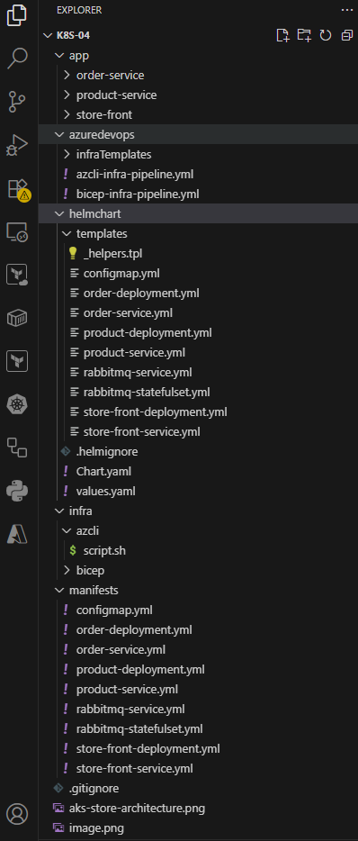

# Part 4: Deploying microservice applications in AKS using Helm Chat

    A sample multi-container application with a group of microservices and web front ends 
    that simulate a retail scenario.

    Part1: Manual Deployment using comand line tools (AzCLI, Docker Desktop and kubectl)  
    GitHub: https://github.com/santosh-gh/k8s-01
    YouTube: https://youtu.be/zoJ7MMPVqFY

    Part2: Automated Deployment using Azure DevOps Pipeline
    GitHub: https://github.com/santosh-gh/k8s-02
    YouTube: https://youtu.be/nnomaZVHg9I

    Part3: Automated Infra Deployment using Bicep and Azure DevOps Pipeline
    GitHub: https://github.com/santosh-gh/k8s-03
    YouTube: https://www.youtube.com/watch?v=5PAdDPHn8F8

    Part4: Deploying microservice applications in AKS using Helm Chat
    GitHub: https://github.com/santosh-gh/k8s-04
    YouTube: https://www.youtube.com/watch?v=5PAdDPHn8F8

# Architesture

    # Store front: Web application for customers to view products and place orders.
    # Product service: Shows product information.
    # Order service: Places orders.
    # RabbitMQ: Message queue for an order queue.

# Directory Structure

 

# Deploying microservice applications in AKS using 

    Infra deploy: using command line AzCLI/Bicep 
        or 
    Pipelines azcli-infra-pipeline.yml/bicep-infra-pipeline.yml

    Docker build and push images to ACR: Docker Desktop command line

    App Deploymnet: Helm command

    helm install online-store ./helmchart

# Steps

    1. Infra deployment using AzCLI/Bicep command line or 
       Pipelines azcli-infra-pipeline.yml/bicep-infra-pipeline.yml

    2. Build and push images to ACR: Docker command

    3. Helm install and Helmfy
       https://helm.sh/docs/intro/install/

       https://github.com/arttor/helmify/releases

       Advantages of helm over kubectl

       Helm uses templates with variables, so no need to duplicate YAML files for each environment

       Helm supports versioned releases and can be roll back to a previous release easily

       helm list
       helm rollback online-store 1

       Parameterization per Environment using enverionment  specific <env>-values.yaml
       helm install online-store ./helmchart -f dev-values-.yaml
       helm install online-store ./helmchart -f test-values.yaml

       Helm keeps track of installed releases, values, and history
       helm list
       helm get all online-store

    4. App deployment: 
       helm install online-store ./helmchart

    5. Validate and Access the application

    6. Clean the Azure resources

# Infra deployment

    # Login to Azure

        az login
        az account set --subscription=<subscriptionId>
        az account show

    # Show existing resources

        az resource list

    # Create RG, ACR and AKS

        # AzCLI
        ./infra/azcli/script.sh

        OR

        # Bicep
        az deployment sub create --location uksouth --template-file ./infra/bicep/main.bicep --parameters ./infra/bicep/main.bicepparam

    # Connect to cluster

        RESOURCE_GROUP="rg-onlinestore-dev-uksouth-001"
        AKS_NAME="aks-onlinestore-dev-uksouth-001"
        az aks get-credentials --resource-group $RESOURCE_GROUP --name $AKS_NAME

    # Short name for kubectl

    # Show all existing objects

        k get all

# Docker Build and Push

    # Log in to ACR

        ACR_NAME="acronlinestoredevuksouth001"
        az acr login --name $ACR_NAME

    # Build and push the Docker images to ACR

        # Order Service
        docker build -t order ./app/order-service 
        docker tag order:latest $ACR_NAME.azurecr.io/order:v1
        docker push $ACR_NAME.azurecr.io/order:v1

        # Product Service
        docker build -t product ./app/product-service 
        docker tag product:latest $ACR_NAME.azurecr.io/product:v1
        docker push $ACR_NAME.azurecr.io/product:v1

        # Store Front Service
        docker build -t store-front ./app/store-front 
        docker tag store-front:latest $ACR_NAME.azurecr.io/store-front:v1
        docker push $ACR_NAME.azurecr.io/store-front:v1

        docker images

# Helm and Helmify

    # helmify 

    helmify -f ./manifests helmchart

    # Helm Deploy

    helm install online-store ./helmchart

    helm uninstall online-store

# Verify the Deployment

    k get pods
    k get services
    curl <LoadBalancer public IP>:80
    Browse the app using http://<LoadBalancer public IP>:80

# Clean the Azure resources

    az group delete --name rg-onlinestore-dev-uksouth-001 --yes --no-wait